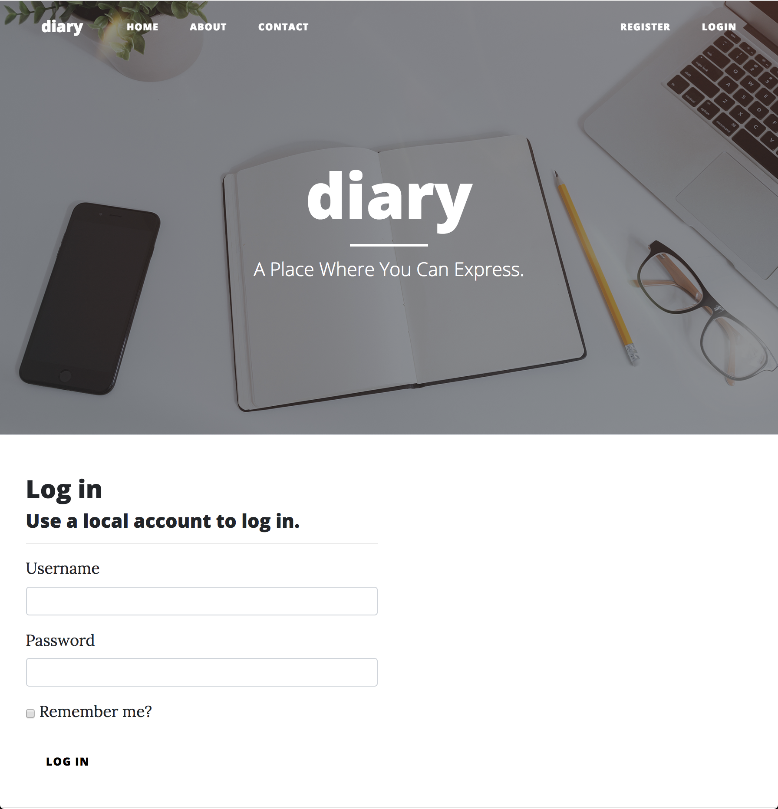

# rest-api-development

CS5331 Assignment 1 Project Reference Repository

## Instructions

Your objective is to implement a web application that provides the endpoints
specified here: https://cs5331-assignments.github.io/rest-api-development/.

The project has been packaged in an easy to set-up docker container with the
skeleton code implemented in Python Flask. You are not restricted in terms of
which language, web stack, or database you desire to use. However, please note
that very limited support can be given to those who decide to veer off the
beaten path.

You may be required to modify the following files/directories:

- Dockerfile - contains the environment setup scripts to ensure a homogenous
  development environment
- src/ - contains the front-end code in `html` and the skeleton Flask API code
  in `service`
- img/ - contains images used for this README

Assuming you're developing on an Ubuntu 16.04 machine, the quick instructions
to get up and running are:

```
# Install Docker

sudo apt-get update
sudo apt-get install \
    apt-transport-https \
    ca-certificates \
    curl \
    software-properties-common
curl -fsSL https://download.docker.com/linux/ubuntu/gpg | sudo apt-key add -
sudo add-apt-repository \
   "deb [arch=amd64] https://download.docker.com/linux/ubuntu \
   $(lsb_release -cs) \
   stable"
sudo apt-get update
sudo apt-get install docker-ce

# Verify Docker Works

sudo docker run hello-world

# Run the skeleton implementation

sudo ./run.sh
```

(Docker CE installation instructions are from this
[link](https://docs.docker.com/install/linux/docker-ce/ubuntu/#install-using-the-repository).)

**Please consult your assignment hand-out for detailed setup information.**

## Grading

The implementation will be graded in an automated fashion on an Ubuntu 16.04
virtual machine by building the docker container found in your repository and
running it. The grading script will interact with your API.

The following ports are expected to be accessible:

1. 80, on which static HTML content, including the front-end, is served.
2. 8080, on which the API is exposed.

To verify this, please run the following commands:

```
sudo ./run.sh
```

On a different window:

```
curl http://localhost:80
curl http://localhost:8080
```

If a response is received, you're good to go.

**Please replace the details below with information relevant to your team.**

## Screenshots



## Administration and Evaluation

### Team Members

1. Muhammad Mustaqiim Bin Muhar
2. Ng Qing Hua
3. Ng Zi Kai
4. Yee Jian Feng, Eric

### Short Answer Questions

#### Question 1: Briefly describe the web technology stack used in your implementation.

Answer: We used ASP.NET Core for the web front-end and along with it, Web API to build our RESTful endpoints. .NET Core is a recent technology offered by Microsoft that enables cross-platform development, similar to what Java is capable of. For the database component, we have used Microsoft SQL Server. For web server to interact with the database, we used EntityFramework, an Object-Relational Mapping Framework, to generate the required SQL to query datasets from the database. This removes the need to write SQL and possibly reducing the attack surface stemming from SQL-related constructs.

#### Question 2: Are there any security considerations your team thought about?

Answer: Avoid the usual XSS, CSRF, SQL Injection & proper session handling.

#### Question 3: Are there any improvements you would make to the API specification to improve the security of the web application?

Answer: Implement JWT Tokens. Query API over https.

#### Question 4: Are there any additional features you would like to highlight?

Answer: The fact that we're probably the only group who used .NET Core! And an ORM that removes the need to know any SQL. :sunglasses:

#### Question 5: Is your web application vulnerable? If yes, how and why? If not, what measures did you take to secure it?

Answer: Of course not? One of the most secure Web Application ever coded within 2 weeks out there! :sunglasses:

#### Feedback: Is there any other feedback you would like to give?

Answer: The API specs seemed to be less consistent after the errata was made. Optional fields that were present only when that had a value did not pose any consistency issues. However, after the errata was made, the `result` field became less consistent. Some API responses had keys nested within the `result` field while others did not have keys present. `POST /diary/create` and `POST /diary` were some examples.

### Declaration

1. Muhammad Mustaqiim Bin Muhar
    - Devops stuff -> Initialized docker-compose with .Net Core installation
    - Unit testing & random bug fixes (Auth bug)
    - Documentation
2. Ng Qing Hua
    - Introduced .Net Core Framework & prepared framework skeleton
    - Diary API
3. Ng Zi Kai
    - Authentication API
4. Yee Jian Feng, Eric
    - Implemented front end UI
